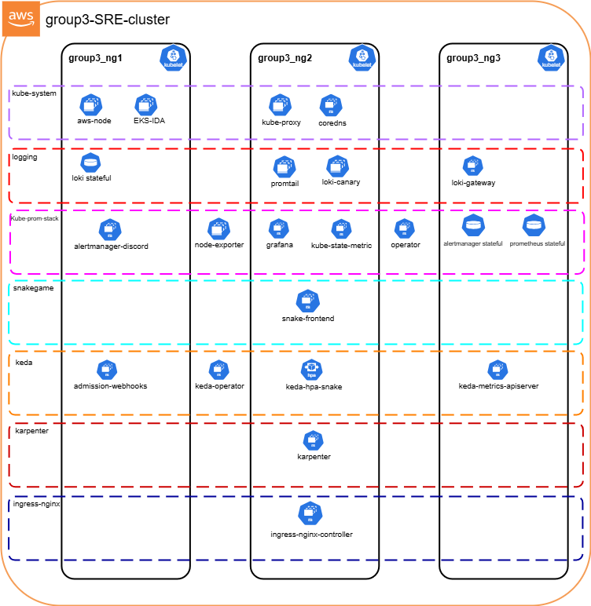

**Reimagining Classic Games with SRE: A Cloud-Native Deployment of Snake**

This capstone project demonstrates the group’s (NTU CE10 group 3) exploration of **Site Reliability Engineering (SRE)** principles through a modern reimagining of the classic Snake Game.  
Originally popularized on Nokia mobile phones in the 2000s, Snake was a simple yet addictive game enjoyed. In this project, we envision how such a game could be deployed today using **cloud-native infrastructure**. Our focus is on three core SRE pillars: **scalability, reliability, and observability**. The goal is to show how Snake can be made globally accessible, monitored in real time, and automatically scaled to meet fluctuating demand.

----------

### Infrastructure

The group deployed Snake Game on **Amazon Web Services (AWS)**, with infrastructure provisioned via **Terraform** and workloads orchestrated using **Kubernetes**.

-   **Terraform**: Chosen as the Infrastructure-as-Code (IaC) tool, Terraform enables us to **define resources declaratively, version-control changes, and provision consistently** across environments. This reduces manual errors and ensures infrastructure can scale predictably as demand grows. 
    
-   **Kubernetes**: Acts as the control plane for running containerized Snake Game services. It automates deployment, scaling, and failover, while allowing us to extend the system with autoscalers and node managers:
    
    -   **KEDA (Kubernetes Event-Driven Autoscaler)**: Dynamically scales pods in response to demand, ensuring workloads expand or shrink in real time with user traffic.
        
    -   **Karpenter**: Manages the underlying compute layer by provisioning or terminating EC2 instances as needed, ensuring enough capacity for pods while keeping costs optimized.

----------
### Architecture Diagram

**AWS Architecture**

**Kubernetes Cluster**

----------
### Continuous Integration & Continuous Deployment (CI/CD)

To streamline deployment and reduce manual intervention, the group implemented **GitHub Actions** as a CI/CD pipeline for both **Terraform infrastructure** and **Kubernetes resources**.

-   **Terraform (Infrastructure Layer)**:
    
    -   A GitHub Actions workflow was set up to validate, plan, and apply Terraform configurations.
        
    -   This ensured that infrastructure changes (e.g., VPCs, EKS cluster, IAM roles) were version-controlled, peer-reviewed, and automatically deployed to AWS when merged into the main branch.
        
-   **Kubernetes (Application Layer)**:
    
    -   A separate workflow automated the deployment of Kubernetes manifests and Helm charts.
        
    -   On code commits (e.g., updates to the Snake Game image or Helm values), the workflow built the container image, pushed it to Amazon ECR, and triggered a rolling update on the EKS cluster.

----------

### Secure External Access

To ensure secure and reliable access to the game:

-   **HTTPS**: Encrypts traffic between players and the backend, protecting privacy and data integrity.
    
-   **ExternalDNS**: Automates DNS record management (e.g., in Route53), ensuring Snake Game is always reachable via human-friendly domain names like `snakegame.com`.
    
-   **Ingress**: Acts as the entry point for external requests, routing them through a load balancer to the correct backend service. This centralizes routing, security, and traffic management.
    

----------

### Availability & Reliability

To guarantee that the game remains responsive under varying traffic:

-   **KEDA**: Monitors demand (e.g., request rates) and scales pods accordingly. Few users = fewer pods. Traffic surge = more pods.
    
-   **Karpenter**: Ensures Kubernetes has enough nodes to run those pods. It automatically provisions new EC2 instances during spikes and reclaims them when demand falls. Together, KEDA and Karpenter deliver elasticity and reliability.
    

----------

### Observability

To monitor system health and enforce SRE practices:

-   **Grafana Cloud**: Provides dashboards and alerts for visualizing performance trends and responding to anomalies.
    
-   **Loki**: Collects and indexes logs for debugging and root cause analysis with minimal overhead.
    
-   **Prometheus**: Scrapes metrics and enforces SLIs/SLOs, forming the backbone of monitoring and alerting.

----------

### 🎯 **Project Outcomes**

-   **Cloud-Native Deployment**: Successfully containerized and deployed the Snake Game on AWS using Kubernetes.
    
-   **Infrastructure as Code**: Provisioned infrastructure with Terraform, ensuring reproducibility and scalability.
    
-   **Secure External Access**: Configured HTTPS, DNS automation (ExternalDNS), and Ingress to enable reliable, secure global access to the game.
    
-   **Autoscaling Implementation**:
    
    -   **Pod-level scaling** via KEDA based on real-time traffic demand.
        
    -   **Node-level scaling** via Karpenter to ensure sufficient compute capacity.
        
-   **Monitoring & Observability**: Set up a full observability stack with Prometheus (metrics), Loki (logs), and Grafana (dashboards/alerts).
    
-   **Resilience Testing**: Validated system reliability through load-testing tools (`hey`, `wrk`) and stress-test deployments to simulate spikes in demand.
----------

## :pushpin: Getting Started with this repositry

## :hammer_and_wrench: Prerequisites

Before you begin, ensure you have met the following requirements:

1. Install WSL into WSL Windows Environment using the following :

    https://learn.microsoft.com/en-us/windows/wsl/install

    Windows Subsystem for Linux (WSL) enables users to run a Linux environment directly on Windows machines. This is valuable because most programming workflows are designed around Unix-based operating systems, with macOS being one such derivative. Software engineers who use Windows typically rely on WSL to ensure compatibility with tools and environments commonly used on Linux systems. Before installing WSL, it is recommended to update Windows to the latest version to avoid potential issues.

    a. Install WSL here.
    
    b. Install the latest version of Ubuntu here. Ubuntu is a popular version of the Linux operating system.
    
    c. Run sudo apt install build-essential in Ubuntu in WSL to install standard libraries Ubuntu needs to further install common packages.
    
    d. Run sudo apt-get install ca-certificates in Ubuntu in WSL to get SSL verification certificates on Ubuntu for Ubuntu to communicate with VS Code on our computer.  

2. Install Git into WSL Windows Environment using the following :

    https://learn.microsoft.com/en-us/windows/wsl/tutorials/wsl-git
    
    sudo apt-get update 
    sudo apt-get install git 
    git –-version 

    git config --global user.name ''YOUR_GITHUB_USERNAME'' 
    git config --global user.email ''YOUR_GITHUB_EMAIL'' 

    git config --global credential.helper store 
    git config --global credential.helper cache  

3. Install AWS CLI into WSL Windows Environment using the following :

    https://docs.aws.amazon.com/cli/latest/userguide/getting-started-install.html

    After installing AWS CLI into WSL. 
    https://docs.aws.amazon.com/cli/latest/userguide/cli-configure-sso.html#sso-configure-profile-manual

    https://docs.aws.amazon.com/cli/latest/userguide/cli-configure-sso.html#sso-configure-profile-auto  

4. Install Terraform CLI into WSL Windows Environment using the following :

    https://developer.hashicorp.com/terraform/tutorials/aws-get-started/install-cli

    https://dev.to/aws-builders/connecting-aws-with-terraform-a-short-guide-4bda

    Create a Terraform Configuration File :
    aws configure

    It will prompt you for the following :  
    AWS Access Key ID       (Enter Access Key ID) 
    AWS Secret Access Key   (Enter Access Key) 
    Default Region Name     (Enter region name) 
    Default Output Format   (Leave as default as JSON)  

## :rocket: Cloning & Deploying this repositry

To clone the respositry, follow these steps:

1. Cloning the repository:

   a. Choose a directory of your choice to clone the repository.
   
   b. Perform the following commands to initialize and clone the repository.

   git init 
   git clone https://github.com/growfatlikeme/capstone_private.git  

2. Setup Terraform Infrastructure & Amazon Elastic Kubernetes Service (EKS) Cluster using Github Actions of the Github repository.

    
   
   Click on **"OIDC Terraform setup"** to run the workflow to setup the Terraform infrastructure.

    

    It will take about 15 - 25 minutes to bring up the network infrastructure. Be patient. 

    Workflow status will prompt you the successful completion of the Terraform setup.  

3. Deployment of Helm

   Click on **"Deploy Helm"** to run the workflow to deploy all the helm charts of the required resources/components.

    

   It will take about 15 - 25 minutes to complete the helm deployment. Be patient too. 

   Workflow status will prompt you the successful completion of the Helm deployment.  

## :construction_worker: Tearing Down of Whole AWS EKS Cluster & Setup

Click on **"OIDC Terraform Teardown"** to run the workflow to deploy all the helm charts of the required resources/components.

  

It will take about 20 minutes to complete the tearing down of the whole cluster and deployment. Be patient again too. 

Workflow status will indicate the successful completion of the Helm deployment.  

## :bookmark_tabs: GitBook

This GitBook contains the documentation of CE10 Group 3 SRE capstone project. It consists of 3 main sections, namely Deployment, Application, and Site Reliability Engineering (SRE).

Below are the links to our capstone project documentation. 

1. **Main Capstone Project Documentation**

   [Introduction | Snake Game Docs](https://snake-game.gitbook.io/snake-game-docs/documentation)

   
2. **Deployment**

   [Helm](https://snake-game.gitbook.io/snake-game-docs/documentation/deployment/helm)

   [GitHub Workflows](https://snake-game.gitbook.io/snake-game-docs/documentation/deployment/github-workflows)

   [Setup Architecture](https://snake-game.gitbook.io/snake-game-docs/documentation/deployment/readme)

3. **Application**

   [Snake Game](https://snake-game.gitbook.io/snake-game-docs/documentation/application/readme)

   [Deployment](https://snake-game.gitbook.io/snake-game-docs/documentation/application/deployment)

   [Infrastructure](https://snake-game.gitbook.io/snake-game-docs/documentation/application/infrastructure)
    

4. **Site Reliability Engineering (SRE)**

   [Status Pages](https://snake-game.gitbook.io/snake-game-docs/documentation/site-reliability-engineering/readme)

   [Load Testing](https://snake-game.gitbook.io/snake-game-docs/documentation/site-reliability-engineering/load-testing)

   [Monitoring](https://snake-game.gitbook.io/snake-game-docs/documentation/site-reliability-engineering/monitoring)
